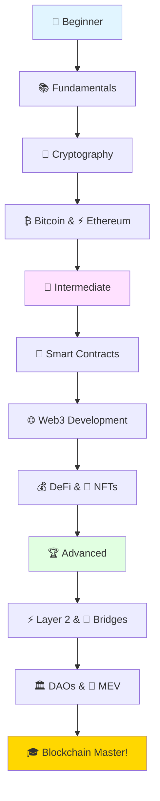

# 🚀 BlockChain Mastery ⛓️ - Complete Learning Path 🎓

> **From Zero to Blockchain Hero** - A comprehensive, interactive guide to mastering blockchain technology from fundamentals to advanced topics! 🌟

<div align="center">

[](https://github.com/mwakidenis/BlockChain-Mastery)
[](https://github.com/mwakidenis/BlockChain-Mastery/network/members)
[](https://github.com/mwakidenis/BlockChain-Mastery/issues)
[](LICENSE)
[](CONTRIBUTING.md)
[](https://github.com/mwakidenis/BlockChain-Mastery/commits/main)


[](https://github.com/mwakidenis)

</div>

Welcome to the most comprehensive blockchain learning repository! 🎉 This repository is designed to take you from complete beginner to building production-ready decentralized applications.

---

## 📑 Table of Contents

- [🚀 BlockChain Mastery ⛓️ - Complete Learning Path 🎓](#-blockchain-mastery-️---complete-learning-path-)
  - [📑 Table of Contents](#-table-of-contents)
  - [📚 Repository Structure](#-repository-structure)
  - [🎯 Learning Path](#-learning-path)
    - [🌱 Beginner Track (Weeks 1-4)](#-beginner-track-weeks-1-4)
    - [🚀 Intermediate Track (Weeks 5-8)](#-intermediate-track-weeks-5-8)
    - [🏆 Advanced Track (Weeks 9-12)](#-advanced-track-weeks-9-12)
  - [🎖️ Achievement Badges](#️-achievement-badges)
  - [🛠️ Prerequisites](#️-prerequisites)
  - [🚀 Quick Start Guide](#-quick-start-guide)
  - [🎓 How to Use This Repository](#-how-to-use-this-repository)
  - [📖 Key Learning Resources](#-key-learning-resources)
  - [💡 Learning Tips](#-learning-tips)
  - [🤝 Contributing](#-contributing)
  - [🔗 Quick Links](#-quick-links)
  - [❓ Frequently Asked Questions (FAQ)](#-frequently-asked-questions-faq)
  - [🌟 Support This Project](#-support-this-project)
  - [📜 License](#-license)
  - [🙏 Acknowledgments](#-acknowledgments)

---



## 🎯 What You'll Learn

<div align="center">

### 🏗️ Build Real-World Projects
Create DApps, Smart Contracts, NFT Marketplaces, DeFi Protocols, and more!

### 💼 Launch Your Career
Get job-ready with portfolio projects and industry-standard skills

### 🌍 Join a Global Community
Connect with thousands of blockchain enthusiasts and developers

### 🆓 Completely Free
No paywalls, no hidden costs - everything is open source and free forever

</div>

---

## 🎓 Who Is This For?

- **👨‍💻 Developers** wanting to enter Web3
- **🎓 Students** learning blockchain technology
- **💼 Professionals** transitioning to blockchain careers
- **🚀 Entrepreneurs** building blockchain startups
- **🤔 Curious minds** wanting to understand decentralization
- **📚 Self-learners** seeking structured learning paths

## 📚 Repository Structure

```
blockchain-web3-learning/
├── README.md                    # This file
├── 00-fundamentals/            # Core blockchain concepts
│   ├── what-is-blockchain.md
│   ├── how-blockchain-works.md
│   ├── blockchain-vs-traditional.md
│   └── consensus-mechanisms.md
├── 01-cryptography/            # Cryptographic foundations
│   ├── hashing-fundamentals.md
│   ├── public-private-keys.md
│   ├── digital-signatures.md
│   └── merkle-trees.md
├── 02-bitcoin/                 # Bitcoin ecosystem
│   ├── bitcoin-basics.md
│   ├── transactions-utxos.md
│   ├── mining-and-nodes.md
│   └── bitcoin-scripting.md
├── 03-ethereum/                # Ethereum platform
│   ├── ethereum-overview.md
│   ├── accounts-and-gas.md
│   ├── ethereum-virtual-machine.md
│   └── ethereum-2.md
├── 04-smart-contracts/         # Smart contract development
│   ├── solidity-basics.md
│   ├── contract-patterns.md
│   ├── security-best-practices.md
│   └── testing-contracts.md
├── 05-web3-development/        # Web3 application development
│   ├── web3-fundamentals.md
│   ├── connecting-to-blockchain.md
│   ├── ethers-vs-web3js.md
│   └── wallet-integration.md
├── 06-defi/                    # Decentralized Finance
│   ├── defi-overview.md
│   ├── uniswap-mechanics.md
│   ├── lending-protocols.md
│   └── yield-farming.md
├── 07-nfts/                    # Non-Fungible Tokens
│   ├── nft-basics.md
│   ├── erc721-standard.md
│   ├── metadata-standards.md
│   └── nft-marketplaces.md
├── 08-projects/                # Hands-on projects
│   ├── 01-simple-blockchain/
│   ├── 02-basic-wallet/
│   ├── 03-voting-dapp/
│   ├── 04-token-exchange/
│   └── 05-nft-marketplace/
├── 09-advanced-topics/         # Advanced concepts
│   ├── layer-2-solutions.md
│   ├── cross-chain-bridges.md
│   ├── dao-governance.md
│   └── mev-flashloans.md
├── resources/                  # Additional learning materials
│   ├── glossary.md
│   ├── recommended-books.md
│   ├── useful-tools.md
│   └── communities.md
└── code-examples/             # Code snippets and examples
    ├── solidity/
    ├── javascript/
    ├── python/
    └── rust/
```

## 🎯 Learning Path

### 🌱 Beginner Track (Weeks 1-4)
- [ ] **Week 1**: Blockchain Fundamentals
  - [ ] What is Blockchain?
  - [ ] How Blockchain Works
  - [ ] Blockchain vs Traditional Systems
  - [ ] **Project**: Build a simple blockchain in Python/JavaScript

- [ ] **Week 2**: Cryptography Essentials
  - [ ] Hashing Functions
  - [ ] Public-Private Key Cryptography
  - [ ] Digital Signatures
  - [ ] **Project**: Create a digital wallet

- [ ] **Week 3**: Bitcoin Deep Dive
  - [ ] Bitcoin Basics
  - [ ] Transactions and UTXOs
  - [ ] Mining Process
  - [ ] **Project**: Bitcoin transaction analyzer

- [ ] **Week 4**: Ethereum Introduction
  - [ ] Ethereum Overview
  - [ ] Accounts and Gas
  - [ ] Ethereum Virtual Machine
  - [ ] **Project**: Deploy your first smart contract

### 🚀 Intermediate Track (Weeks 5-8)
- [ ] **Week 5**: Smart Contract Development
  - [ ] Solidity Programming
  - [ ] Contract Patterns
  - [ ] Testing Frameworks
  - [ ] **Project**: ERC-20 Token

- [ ] **Week 6**: Web3 Development
  - [ ] Web3 Fundamentals
  - [ ] Frontend Integration
  - [ ] Wallet Connections
  - [ ] **Project**: Token Transfer DApp

- [ ] **Week 7**: DeFi Protocols
  - [ ] DeFi Overview
  - [ ] AMM Mechanics
  - [ ] Lending/Borrowing
  - [ ] **Project**: Simple DEX

- [ ] **Week 8**: NFTs and Digital Assets
  - [ ] NFT Standards
  - [ ] Metadata Handling
  - [ ] Marketplace Mechanics
  - [ ] **Project**: NFT Minting DApp

### 🏆 Advanced Track (Weeks 9-12)
- [ ] **Week 9**: Advanced Smart Contracts
  - [ ] Upgradeable Contracts
  - [ ] Multi-signature Wallets
  - [ ] Oracle Integration
  - [ ] **Project**: DAO Governance System

- [ ] **Week 10**: Layer 2 & Scaling
  - [ ] Polygon/Arbitrum
  - [ ] State Channels
  - [ ] Rollups
  - [ ] **Project**: Cross-chain bridge

- [ ] **Week 11**: Security & Auditing
  - [ ] Common Vulnerabilities
  - [ ] Audit Tools
  - [ ] Best Practices
  - [ ] **Project**: Security audit checklist

- [ ] **Week 12**: Production Deployment
  - [ ] Mainnet Deployment
  - [ ] Gas Optimization
  - [ ] Monitoring & Analytics
  - [ ] **Final Project**: Full-stack DApp

## 🎖️ Achievement Badges

Track your progress with these achievement badges:

- 🌱 **Blockchain Basics** - Complete fundamentals section
- 🔐 **Crypto Master** - Complete cryptography section  
- ₿ **Bitcoin Explorer** - Complete Bitcoin deep dive
- ⚡ **Ethereum Developer** - Deploy first smart contract
- 🛠️ **Smart Contract Architect** - Build 3 different contract types
- 🌐 **Web3 Builder** - Create full-stack DApp
- 💰 **DeFi Developer** - Build DeFi protocol
- 🎨 **NFT Creator** - Launch NFT collection
- 🏛️ **DAO Founder** - Create governance system
- 🔒 **Security Expert** - Complete security audit
- 🚀 **Production Ready** - Deploy to mainnet

## 🛠️ Prerequisites

### Required Knowledge
- Basic programming experience (JavaScript/Python recommended)
- Understanding of web development fundamentals
- Command line basics
- Git version control

### Development Environment Setup
```bash
# Install Node.js and npm
curl -o- https://raw.githubusercontent.com/nvm-sh/nvm/v0.39.0/install.sh | bash
nvm install node

# Install development tools
npm install -g truffle ganache-cli hardhat

# Install code editor extensions
# - Solidity syntax highlighting
# - Web3 development tools
```

## 🚀 Quick Start Guide

Ready to begin your blockchain journey? Follow these steps:

### For Complete Beginners

1. **Start with the Basics** 📚
   - Read [What is Blockchain?](00-fundamentals/What-is-blockchain.md)
   - Understand [How Blockchain Works](00-fundamentals/How-Blockchain-works.md)
   - Learn about [Consensus Mechanisms](00-fundamentals/consensus-mechanisms.md)

2. **Set Up Your Learning Environment** 💻
   ```bash
   # Clone this repository
   git clone https://github.com/mwakidenis/BlockChain-Mastery.git
   cd BlockChain-Mastery
   
   # Install Node.js (if not already installed)
   # Visit https://nodejs.org/ for installation instructions
   
   # Create a study plan
   # Follow the weekly learning path below
   ```

3. **Join the Community** 🤝
   - Check out our [Communities Guide](resources/communities.md)
   - Star ⭐ this repository to stay updated
   - Join discussions in Issues and Discussions

4. **Build Your First Project** 🏗️
   - Complete Week 1's simple blockchain project
   - Share your progress with the community
   - Get feedback and iterate

### For Developers

1. **Set Up Development Tools** 🛠️
   ```bash
   # Install essential tools
   npm install -g hardhat
   npm install -g @truffle/truffle
   
   # Create your first project
   mkdir my-blockchain-project
   cd my-blockchain-project
   npx hardhat init
   ```

2. **Explore Code Examples** 💻
   - Browse the [code-examples](code-examples/) directory
   - Study smart contract patterns
   - Run and modify examples

3. **Follow the Learning Path** 🎯
   - Skip to your skill level
   - Complete hands-on projects
   - Review [Recommended Books](resources/recommended-books.md)

4. **Use Development Tools** 🔧
   - Explore [Useful Tools](resources/useful-tools.md)
   - Set up MetaMask wallet
   - Get testnet tokens from faucets

## 🎓 How to Use This Repository

1. **Start with Fundamentals**: Begin with the `00-fundamentals/` directory
2. **Follow the Learning Path**: Use the structured weekly progression
3. **Complete Projects**: Each section includes hands-on projects
4. **Join the Community**: Connect with other learners
5. **Contribute**: Add your own examples and improvements

## 📖 Key Learning Resources

### Essential Concepts
- **Blockchain**: Distributed ledger technology
- **Smart Contracts**: Self-executing contracts with terms directly written into code
- **DApps**: Decentralized applications running on blockchain networks
- **Web3**: Decentralized internet built on blockchain technology

### Development Stack
- **Frontend**: React.js, Next.js, Vue.js
- **Blockchain Interaction**: Ethers.js, Web3.js
- **Smart Contracts**: Solidity, Vyper
- **Development Framework**: Hardhat, Truffle, Foundry
- **Testing**: Mocha, Chai, Waffle

### Networks & Tools
- **Testnets**: Goerli, Sepolia, Mumbai
- **Wallets**: MetaMask, WalletConnect
- **Block Explorers**: Etherscan, Polygonscan
- **IPFS**: InterPlanetary File System for decentralized storage

## 💡 Learning Tips

### Best Practices for Success

1. **Consistency Over Intensity** 📅
   - Dedicate 1-2 hours daily rather than cramming
   - Take breaks to avoid burnout
   - Review previous topics regularly

2. **Learn by Building** 🏗️
   - Don't just read - code along
   - Modify examples to test understanding
   - Build small projects regularly
   - Share your work for feedback

3. **Join Study Groups** 👥
   - Find an accountability partner
   - Join online study sessions
   - Participate in hackathons
   - Contribute to open source

4. **Document Your Journey** 📝
   - Keep a learning journal
   - Write blog posts about what you learn
   - Create tutorials for others
   - Build a portfolio of projects

5. **Stay Updated** 🔄
   - Follow key developers on Twitter
   - Read weekly newsletters (Week in Ethereum)
   - Join Discord communities
   - Attend virtual meetups

6. **Security First** 🔒
   - Never share private keys
   - Test on testnets first
   - Learn security best practices early
   - Audit your own code

7. **Ask Questions** ❓
   - No question is too basic
   - Use Stack Exchange Ethereum
   - Join Discord help channels
   - Search before asking

8. **Practice Problem-Solving** 🧩
   - Try coding challenges (CryptoZombies, Ethernaut)
   - Debug others' code
   - Participate in code reviews
   - Solve real-world problems

### Common Pitfalls to Avoid

- ❌ Jumping to advanced topics too quickly
- ❌ Not testing code thoroughly
- ❌ Ignoring security considerations
- ❌ Learning in isolation
- ❌ Collecting courses without completing them
- ❌ Not reading documentation
- ❌ Fear of making mistakes (mistakes are learning opportunities!)

### Recommended Study Schedule

**Weekday (1-2 hours)**
- 30 min: Reading/watching tutorials
- 30 min: Hands-on coding
- 30 min: Community participation/review

**Weekend (3-4 hours)**
- 1 hour: Theory and concepts
- 2 hours: Building projects
- 1 hour: Code review and refactoring

## 🤝 Contributing

We welcome contributions! Please read our [Contributing Guidelines](CONTRIBUTING.md) to get started.

### Ways to Contribute
- Add new tutorials or explanations
- Improve existing content
- Create new projects
- Fix bugs in code examples
- Translate content to other languages

## 🔗 Quick Links

- [Glossary](resources/glossary.md) - Blockchain terminology
- [Tools & Resources](resources/useful-tools.md) - Development tools
- [Books & Courses](resources/recommended-books.md) - Extended learning
- [Communities](resources/communities.md) - Join the conversation
- [Roadmap](ROADMAP.md) - Project future plans and goals
- [Changelog](CHANGELOG.md) - Version history and updates
- [Contributors](CONTRIBUTORS.md) - Amazing people who help

## ❓ Frequently Asked Questions (FAQ)

### Getting Started

**Q: Do I need to know programming before starting?**  
A: Basic programming knowledge (JavaScript or Python) is helpful but not required. We provide resources for complete beginners.

**Q: How long does it take to complete this course?**  
A: The structured path is 12 weeks (3 months) for 1-2 hours daily. However, you can learn at your own pace.

**Q: Is this free?**  
A: Yes! All content in this repository is completely free. Some external resources may have paid options, but we primarily link to free content.

**Q: What programming language should I learn first?**  
A: Start with JavaScript for Web3 development, or Python for blockchain basics. Solidity is essential for smart contracts.

### Technical Questions

**Q: Do I need expensive equipment?**  
A: No! A standard computer with internet access is sufficient. Development happens on testnets (free).

**Q: Which blockchain should I focus on?**  
A: Start with Ethereum - it has the largest developer ecosystem and best learning resources. You can explore others later.

**Q: Do I need to buy cryptocurrency to learn?**  
A: No! You can practice on testnets with free test tokens from faucets. Real crypto is only needed for mainnet deployment.

**Q: What's the difference between Web2 and Web3 development?**  
A: Web3 adds blockchain integration, smart contracts, and decentralized storage. Traditional web skills are still valuable.

### Career Questions

**Q: Can I get a job after completing this?**  
A: Yes! Complete the learning path, build a portfolio, contribute to open source, and network in the community.

**Q: What jobs are available in Web3?**  
A: Smart Contract Developer, DApp Developer, Blockchain Engineer, Security Auditor, Developer Advocate, and more.

**Q: How much do blockchain developers earn?**  
A: Salaries vary by location and experience, but blockchain developers are in high demand with competitive compensation.

### Community Questions

**Q: How can I contribute to this repository?**  
A: Check our [Contributing Guide](CONTRIBUTING.md) for ways to help - from fixing typos to adding new content.

**Q: Where can I get help if I'm stuck?**  
A: Join our community discussions, ask in Discord servers, use Stack Exchange Ethereum, or open an issue here.

**Q: Are there any prerequisites I must complete first?**  
A: Basic computer literacy and willingness to learn. Everything else is taught in the course.

**Q: Can I use this for teaching others?**  
A: Absolutely! This is open source (MIT License). Feel free to use it for education, just provide attribution.

### Security & Safety

**Q: How do I keep my crypto safe while learning?**  
A: Never share private keys, use testnets for learning, enable 2FA, and read our [Security Guide](SECURITY.md).

**Q: What if I make a mistake on the blockchain?**  
A: Blockchain transactions are irreversible! Always test on testnets first. Learn from mistakes.

**Q: Are there scams in Web3?**  
A: Yes, unfortunately. Be skeptical of "too good to be true" offers, verify everything, and never share private keys.

## 🌟 Support This Project

If you find this repository helpful, here's how you can support:

### Free Ways to Support

- ⭐ **Star this repository** - Help others discover it
- 🍴 **Fork and share** - Spread the knowledge
- 💬 **Join discussions** - Engage with the community
- 🐛 **Report issues** - Help us improve
- 📖 **Share your experience** - Write testimonials or blog posts
- 🤝 **Help others** - Answer questions in discussions
- 🔀 **Submit PRs** - Contribute content or fixes

### Share on Social Media

Spread the word about this resource:

```markdown
Just found an amazing FREE blockchain learning resource! 🚀
Complete guide from basics to advanced Web3 development.
Check it out: https://github.com/mwakidenis/BlockChain-Mastery
#blockchain #web3 #ethereum #learning #opensource
```

### Contribute Content

- Write tutorials or guides
- Create code examples
- Translate content to other languages
- Record video walkthroughs
- Design infographics or diagrams

### Financial Support

If you'd like to support financially:
- Consider contributing to the open-source projects we rely on
- Support blockchain education initiatives
- Hire developers from this community
- Sponsor blockchain hackathons

### Recognition

**Top Contributors** (These awesome people made this possible!)
- Contributors will be listed here as the project grows
- Special recognition for significant contributions
- Community showcase for completed projects

## 📜 License

This project is licensed under the MIT License - see the [LICENSE](LICENSE) file for details.

## 🙏 Acknowledgments

Special thanks to the blockchain and Web3 community for their continuous innovation and open-source contributions that make learning accessible to everyone.

### Inspired By
- Ethereum Foundation and ethereum.org contributors
- OpenZeppelin for security best practices
- Patrick Collins and the Cyfrin team
- Austin Griffith and Scaffold-ETH
- The entire open-source blockchain community

### Built With
- ❤️ **Passion** for decentralization and education
- 📚 **Knowledge** from countless developers and educators
- 🌍 **Community** feedback and contributions
- ⏰ **Time** and dedication from contributors worldwide

---

## 🎯 Project Roadmap

### Current Status: Active Development ✅

### Upcoming Features
- [ ] Interactive code playground
- [ ] Video tutorial series
- [ ] Multilingual support (Spanish, Chinese, French)
- [ ] Mobile-friendly learning app
- [ ] Certification system
- [ ] Live coding sessions
- [ ] Mentorship program
- [ ] Job board integration

### Version History
- **v1.0** - Initial release with core content
- **v1.1** - Added community resources and tools
- **v1.2** - Enhanced documentation and guides

---

## 📞 Connect With Us

### Maintainer
- **GitHub**: [@mwakidenis](https://github.com/mwakidenis)

### Community Channels
- **Discussions**: [GitHub Discussions](https://github.com/mwakidenis/BlockChain-Mastery/discussions)
- **Issues**: [Report bugs or request features](https://github.com/mwakidenis/BlockChain-Mastery/issues)
- **Pull Requests**: [Contribute code](https://github.com/mwakidenis/BlockChain-Mastery/pulls)

### Social Media
Share your progress with `#BlockChainMastery` 🚀

---

## 📊 Repository Stats


---

## ⚡ Quick Access

| Resource | Description | Link |
|----------|-------------|------|
| 📚 **Fundamentals** | Start here if you're new | [00-fundamentals](00-fundamentals/) |
| 🔐 **Cryptography** | Security foundations | [01-cryptography](01-cryptography/) |
| 💰 **Bitcoin** | First cryptocurrency | [02-bitcoin](02-bitcoin/) |
| ⚡ **Ethereum** | Smart contract platform | [03-ethereum](03-ethereum/) |
| 📝 **Smart Contracts** | Write code on blockchain | [04-smart-contracts](04-smart-contracts/) |
| 🌐 **Web3 Dev** | Build DApps | [05-web3-development](05-web3-development/) |
| 💎 **DeFi** | Decentralized finance | [06-defi](06-defi/) |
| 🎨 **NFTs** | Digital collectibles | [07-nfts](07-nfts/) |
| 🏗️ **Projects** | Hands-on building | [08-projects](08-projects/) |
| 🚀 **Advanced** | Expert topics | [09-advanced-topics](09-advanced-topics/) |

---

<div align="center">

**Ready to start your blockchain journey?** 🚀

Begin with [What is Blockchain?](00-fundamentals/What-is-blockchain.md) and take your first step into the decentralized future!

### ⭐ Star This Repository ⭐

If you find this helpful, please star ⭐ this repository and share it with fellow learners!

**Together, we're building the decentralized future!** 🌐

---

Made with ❤️ by the Blockchain Community | Maintained by **Mwaki Denis** ❤️[](https://wa.me/254798750585)


**Last Updated**: December 2025 | **License**: MIT | **Status**: 🟢 Active

</div>
